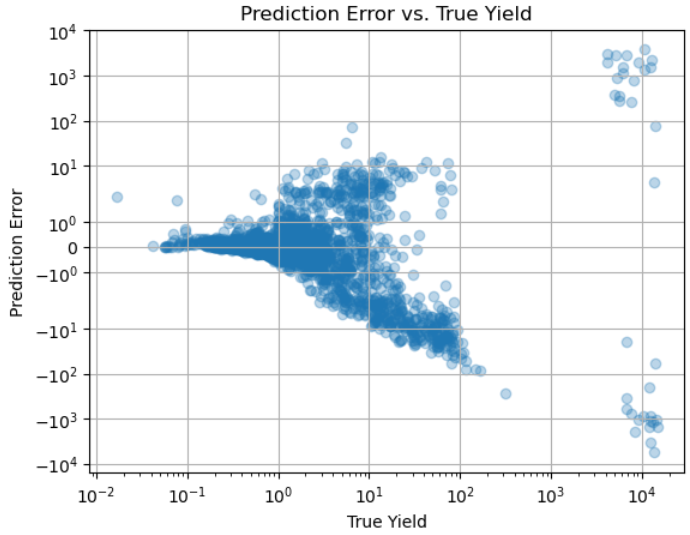
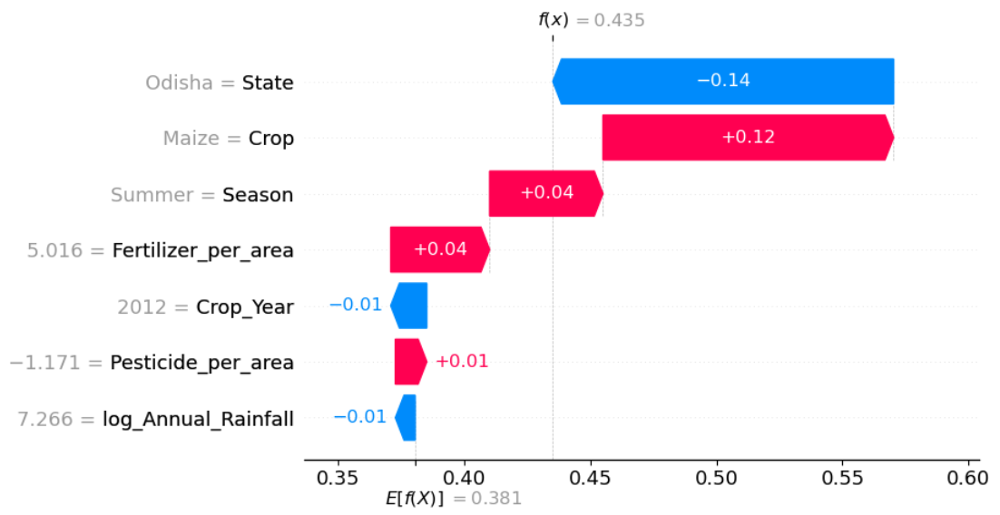
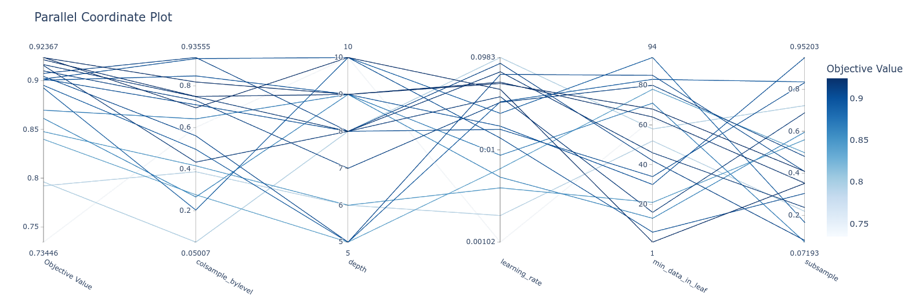

# Crop Yield Prediction  

A robust machine learning model that predicts crop yields using key agricultural features like crop type, state, season, area, rainfall, pesticide, and fertilizer usage. This model is designed to assist farmers, agricultural planners, and researchers in making data-driven decisions to maximize productivity and sustainability.  

---

## Features  

- **CatBoost Regrassor** for Prediction  
- Explainable AI with **SHAP** for transparency  
- Hyper Parameter Tuning using **Optuna**  
- **Log-transformation** for stable and normalized target distribution  
- Insight into which features impact yield the most  

---

## Model  

The notebook (`model.ipynb`) builds a regression model based on Categorical Boosting where the target variable is `Yield` (computed as `Production / Area`). It uses structured agricultural data with features such as:  
 
- `Crop`  
- `Crop_Year`  
- `Season`  
- `State`  
- `Area`  
- `Production`  
- `Annual_Rainfall`  
- `Fertilizer`  
- `Pesticide`  
---

## Training & Evaluation  

- To improve prediction stability and normalize skewed yield distribution, we apply a **log transformation** to the target variable:  

		```python
		df = df[df['Yield'] > 0]
		df['log_yield'] = df['Yield'].apply(lambda x: np.log(x))

		# similarly with Fertilizer and Pesticides per Area
		```

- Data split (4:1) into training and testing sets

- **Evaluation Metrics**

	| Metric                                       | Value     |
	|----------------------------------------------|-----------|
	| Mean Absolute Error (MAE)                    | 16.7743   |
	| Median Absolute Error                        | 0.1770    |
	| Median Absolute Percentage Error             | 0.3099    |
	| R² Score                                     | 0.9553    |
	| Adjusted R² Score                            | 0.9552    |

----

## Plots

### Prediction Error Vs True Yield


### Shap Plot  


### Optuna Hyperparameter Tuning  
  

----
Dataset: https://www.kaggle.com/datasets/akshatgupta7/crop-yield-in-indian-states-dataset